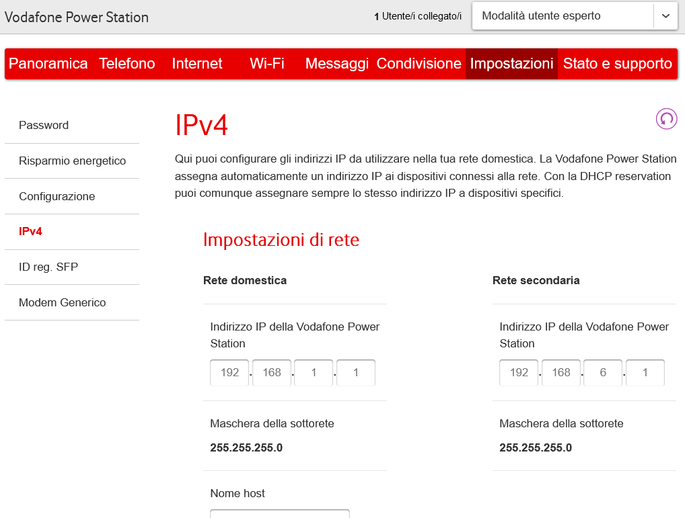
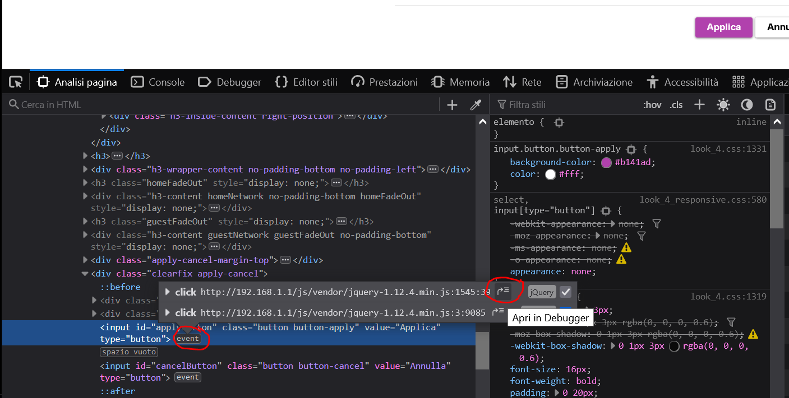
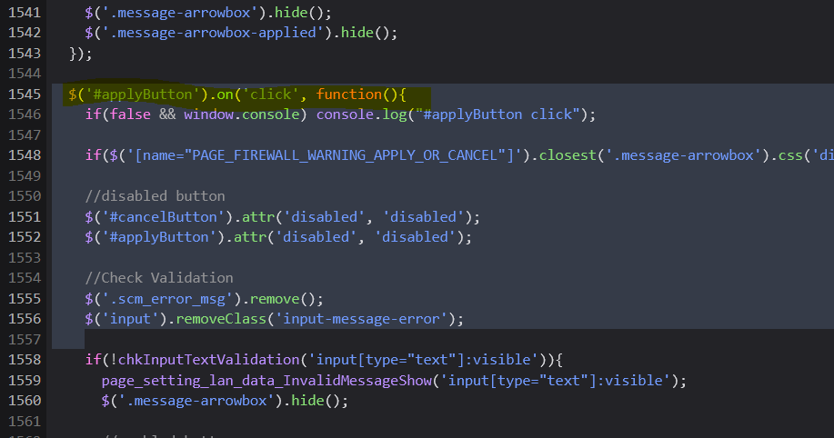
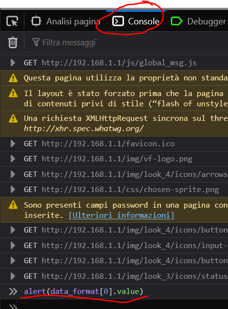

# Vodafone Power Station (SERCOMM VOX30) - procedura per disabilitare il server DHCP - ([English](/README.md))

Lo scopo di questa procedura è quello di disabilitare il DHCP server interno della Vodafone Power Station (VPS), distribuita in Italia dal famoso provider: in particolare si riferisce al modello SERCOMM VOX30, presente sul mercato con diversi nomi:
* Vodafone Power Station (SHG3000, Italia)
* Vodafone Wi-Fi Hub (THG3000, UK)
* Vodafone Gigabox (SHG3000, Irlanda)

Su questo router il DHCP server non può essere disattivato; l'unico trucco disponibile per limitare il suo funzionamento è quello di restringere il range di indirizzi IP serviti dal DHCP ad un singolo indirizzo; in questo modo però il server rimane comunque in esecuzione e può generare problemi di funzionamento di rete se un secondo DHCP server è presente in rete (es. Pi-hole): infatti, la maggior parte delle volte, la VPS, essendo al centro della rete, sarà spesso la più veloce a rispondere alle richieste DHCP provenienti dai client in rete. Tuttavia la risposta sarà un negativo ("No address range available for DHCP request"). Questo comportamento può generare continue richieste DHCP (Discover) da parte dei client che in questo modo non riescono ad ottenere un indirizzo IP valido.

Questa procedura si basa sulla possibilità di iniettare alcuni parametri di configurazione dall'interfaccia web del router verso il suo backend. Fortunatamente il router prevede internamente la possibilità di attivare o disattivare il server DHCP; il limite risiede soltanto nell'interfaccia web di configurazione, che implementa alcuni controlli di consistenza degli input inseriti dall'utente tramite browser. Questi controlli sono implementati nel client (JS che gira nel proprio browser), quindi è possibile forzare la scrittura di alciuni parametri che consentono di disattivare il DHCP server (Per la rete principale e quella Ospiti).

_Questa procedura è fornita così com'è, senza alcuna garanzia di ogni tipo. In nessun caso l'autore può essere ritenuto responsabile di danni o altri problemi._

In ogni caso, se qualcosa dovesse andare storto, si può sempre ricorrere ad un 'Reset di fabbrica' della VPS.
Questa procedura è stata provata con il firmware XS_3.9.00.05.
Ricordate che la sessione http scade dopo pochi minuti, fate in fretta a completare le operazioni!

Procedura:

1. In modalità utente _esperto_, andare nella pagina Impostazioni / IPv4 del router

  
 
2. Attivare il tool di 'Analisi' presente nella maggior parte dei browser moderni (Io uso Firefox) e agganciare la parte interna del tasto _Appica_, come nella seguente figura:

  
  
3. The Analyze tool jumps to the HTML code associated to the _Apply_ button. We are interested in the events associated to this button (click on 'event' label). Two events are available, one handles the animation of the button (Bubbling); the other one (JQuery) handles the interesting things (click on the _jump_ icon).

  
  
4. The JS _applyButton on click_ function is reached, but the 'send to the server' code is about 400 hundreds lines later... after a lot of input validation code, that we have to cheat :)
  Scroll down until function _dataBatchSend_ is found:

  
  
5. Set a breakpoint on this line (click on the line's number) and then click on the _Apply_ button to trigger the event. If you correctly set the breakpoint you should reach this line very fast:

  
  
6. If you notice some lines before there is a piece of code that fills the _data_format_ structure, which is passed to _dataBatchSend_ function. This structure contains all the validated inputs present on the web form, all validated by the above code, such as DHCP Start/End IP, Subnet mask... You can also notice _settingsLanDHCP_ and _settingsLanDHCP_guest_

   You can use the JS console to inspect that structure. Well, actually it's an array of objects. For example you can inspect the content of some elements using the _alert_ function, equivalent to old glory _printf_ :)

  

7. Now it's the turn to modify the DHCP enable parameters: _settingsLanDHCP_ and _settingsLanDHCP_guest_: in the JS console write "0" to the third and fourth object's value of the array to disable both main and guest DHCP servers

  
  
8. Now click the _Continue execution_ icon in the debugger controls panel

  
  
9. The settings are confermed and your VPS DHCP server should be gone!

  

10. Reload the IPv4 configuration page. Some time may be required by the router to apply changes, networks may be disconnected, so be prepared with a static IP address for your client or a brand new DHCP server :)

