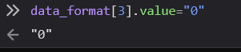

# Vodafone Power Station (SERCOMM VOX30) - disable DHCP server procedure ([Italiano](/LEGGIMI.md))

The scope of this procedure is to disable the internal DHCP server running on the Vodafone Power Station (VPS) distributed in Italy by the provider: the SERCOMM VOX30 has been marketed under different names, which are:
* Vodafone Power Station (SHG3000, distributed in Italy)
* Vodafone Wi-Fi Hub (THG3000, distributed in the UK)
* Vodafone Gigabox (SHG3000, distributed in Ireland)

On this router DHCP server cannot be disabled; the only trick available was to shrink the IP addresses range available to DHCP to a single address, but actually the server remains active and can produce jam if another DHCP server is present on the network (e.g. Pi-hole): in fact, most of the times, being the VPS the central point of the LAN, it is the fastest DHCP to reply to client requests with a negative response ("No address range available for DHCP request"). These generates DHCP requests loops by the client that cannot get the network interfaces configured.

The procedure is based on injection of parameters in the web interface of the VPS. Fortunatelly the VPS backend already implements the possibility to enable or disable the DHCP server, but actually the web interface does not allow this setting. Being most of the input validation on client side (JS running in the browser), it is possible to force writing the disable bits of the DHCP server (main LAN and Guest LAN).

_This procedure is provided "as is", without warranty of any kind. In no event shall the authors be liable for any claim, damages or other liability._

Anyway if something goes wrong you can always force a factory reset of the VPS.
The following procedure have been tested on VPS with firmware XS_3.9.00.05.
The http session expires in few minutes, be quick!

Procedure:

1. As _expert_ user mode, go to the Settings / IPv4 page

  
 
2. Start the 'Analyze' tool within your web browser (I personally use Firefox) and catch the _Apply_ button inner hook, as in figure:

  
  
3. The Analyze tool jumps to the HTML code associated to the _Apply_ button. We are interested in the events associated to this button (click on 'event' label). Two events are available, one handles the animation of the button (Bubbling); the other one (JQuery) handles the interesting things (click on the _jump_ icon).

  
  
4. The JS _applyButton on click_ function is reached, but the 'send to the server' code is about 400 hundreds lines later... after a lot of input validation code, that we have to cheat :)
  Scroll down until function _dataBatchSend_ is found:

  
  
5. Set a breakpoint on this line (click on the line's number). Then modify one of the form's inputs (e.g last digit of the secondary DHCP range) and then click on the _Apply_ button to trigger the event. If you correctly set the breakpoint you should reach this line very fast:

  
  
6. If you notice some lines before there is a piece of code that fills the _data_format_ structure, which is passed to _dataBatchSend_ function. This structure contains all the validated inputs present on the web form, all validated by the above code, such as DHCP Start/End IP, Subnet mask... You can also notice _settingsLanDHCP_ and _settingsLanDHCP_guest_

   You can use the JS console to inspect that structure. Well, actually it's an array of objects. For example you can inspect the content of some elements using the _alert_ function, equivalent to old glory _printf_ :)

  

7. Now it's the turn to modify the DHCP enable parameters: _settingsLanDHCP_ and _settingsLanDHCP_guest_: in the JS console write "0" to the third and fourth object's value of the array to disable both main and guest DHCP servers

  
  
8. Now click the _Continue execution_ icon in the debugger controls panel

  
  
9. The settings are confermed and your VPS DHCP server should be gone!

  

10. Reload the IPv4 configuration page. Some time may be required by the router to apply changes, networks may be disconnected, so be prepared with a static IP address for your client or a brand new DHCP server :)

